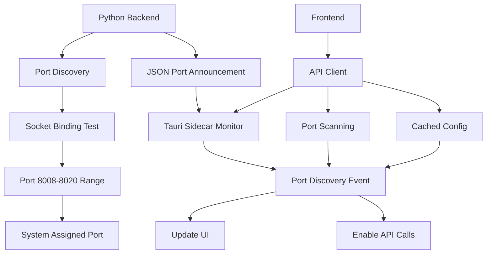

# Dynamic Port Discovery System

## Overview

This Tauri + Svelte + Python template implements a robust dynamic port discovery system that automatically finds available ports for the Python FastAPI backend, eliminating port conflicts and improving the development experience.

## How It Works

### 1. Backend Port Discovery

The Python backend (`src-python/main.py`) implements intelligent port discovery:

```python
def find_available_port(start_port=8008, end_port=8020):
    """Find an available port in the specified range"""
    for port in range(start_port, end_port + 1):
        if is_port_available(port):
            return port
    
    # Fallback to system-assigned port
    with socket.socket(socket.AF_INET, socket.SOCK_STREAM) as s:
        s.bind(('127.0.0.1', 0))
        return s.getsockname()[1]
```

**Features:**
- Scans ports 8008-8020 for availability
- Falls back to system-assigned port if range is exhausted
- Announces discovered port via structured JSON output
- Works in both sidecar and standalone modes

### 2. Frontend Port Detection

The frontend (`src/lib/utils.ts` and `src/lib/tauri-api.ts`) implements multiple discovery strategies:

```typescript
class ApiClient {
    private async detectSidecarPort() {
        await Promise.race([
            this.detectFromTauriSidecar(),
            this.detectFromStandardPorts(),
            this.detectFromStoredConfig()
        ]);
    }
}
```

**Detection Methods:**
1. **Tauri Sidecar Monitoring**: Listens for structured port announcements
2. **Port Scanning**: Tests standard port range (8008-8020)
3. **Cached Configuration**: Uses previously discovered valid configurations

### 3. Structured Communication

The backend announces port information in a structured format:

```json
{
  "type": "port_info",
  "mode": "sidecar",
  "port": 8009,
  "url": "http://127.0.0.1:8009",
  "docs_url": "http://127.0.0.1:8009/docs",
  "health_url": "http://127.0.0.1:8009/health"
}
```

## Usage

### Development Modes

#### 1. Tauri Development
```bash
pnpm tauri dev
```
- Frontend runs on port 1420
- Backend automatically discovers available port (8008-8020)
- Full Tauri integration with sidecar monitoring

#### 2. Standalone Web Development
```bash
pnpm run dev:standalone
```
- Frontend runs on port 5173
- Backend runs in standalone mode with auto-reload
- Perfect for API development and testing

#### 3. API-Only Development
```bash
pnpm run dev:api
```
- Runs only the Python backend
- Automatic port discovery
- Useful for backend-focused development

### Frontend Integration

#### Using the API Client

```typescript
import { apiClient, makeApiCall } from '$lib/tauri-api';

// Simple API call with automatic port discovery
const data = await makeApiCall('/v1/endpoint');

// Listen for port discovery events
apiClient.onPortDiscovered((config) => {
    console.log(`API available at ${config.baseUrl}`);
});
```

#### Reactive API Store (Svelte)

```typescript
import { createApiStore } from '$lib/tauri-api';

const apiStore = createApiStore();

// Subscribe to config changes
apiStore.subscribe((config) => {
    console.log(`Port: ${config.port}, Available: ${config.available}`);
});
```

## Benefits

### 🚀 **Zero Configuration**
No need to manually configure ports or worry about conflicts.

### 🔄 **Automatic Recovery**
If the configured port becomes unavailable, the system automatically finds alternatives.

### 💾 **Intelligent Caching**
Discovered configurations are cached for improved startup performance.

### 🔗 **Seamless Integration**
All API calls automatically use the discovered port without manual intervention.

### 📊 **Visual Feedback**
The UI shows real-time connection status and port information.

## Architecture



## Error Handling

### Backend Errors
- Graceful fallback to system-assigned ports
- Clear error messages with port information
- Automatic retry mechanisms

### Frontend Errors
- Timeout handling for port discovery
- Fallback to manual configuration
- User-friendly error messages with troubleshooting hints

## Configuration

### Environment Variables

```bash
# Force specific port (overrides discovery)
export API_PORT=8010

# Enable debug logging
export DEBUG_PORT_DISCOVERY=true

# Set discovery timeout
export PORT_DISCOVERY_TIMEOUT=10000
```

### Manual Override

If automatic discovery fails, you can manually specify the port:

```typescript
// Override API base URL
apiClient.updateConfig({
    baseUrl: 'http://127.0.0.1:8010',
    port: 8010,
    available: true
});
```

## Troubleshooting

### Common Issues

1. **"API server not available"**
   - Check if Python backend is running
   - Verify no firewall blocking ports 8008-8020
   - Try refreshing port discovery

2. **"Port discovery timeout"**
   - Backend may be slow to start
   - Check Python dependencies are installed
   - Increase timeout in configuration

3. **"Connection refused"**
   - Backend crashed during startup
   - Check Python console for errors
   - Verify requirements.txt dependencies

### Debug Commands

```bash
# Test port availability manually
python -c "import socket; s=socket.socket(); s.bind(('127.0.0.1', 8008)); print('Port 8008 available')"

# Check running processes on port range
lsof -i :8008-8020

# Test API health endpoint
curl http://127.0.0.1:8008/health
```

## Future Enhancements

- [ ] WebSocket-based real-time port announcements
- [ ] Service discovery integration (Consul, etcd)
- [ ] Load balancing across multiple backend instances
- [ ] Port reservation and conflict resolution
- [ ] Metrics and monitoring for port usage

## Contributing

When contributing to the port discovery system:

1. Test both sidecar and standalone modes
2. Verify error handling and fallback mechanisms
3. Update documentation for new features
4. Add unit tests for port discovery logic
5. Test on different operating systems

---

*This dynamic port discovery system ensures a smooth development experience regardless of your local environment setup.* 